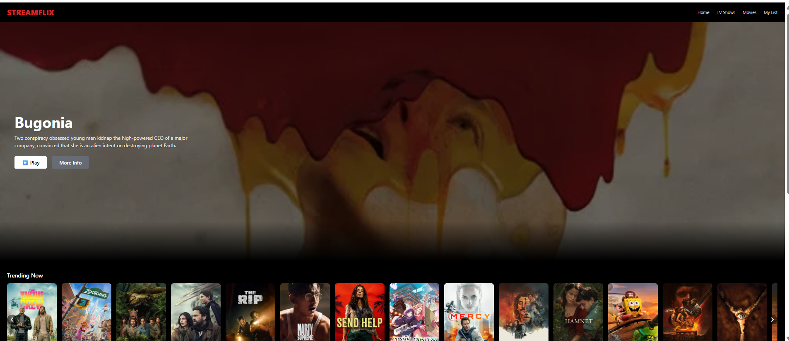

# 🎬 Streamflix

Streamflix is a Netflix-inspired movie streaming user interface built with React.  
It fetches real-time movie data from The Movie Database (TMDB) API and presents it in a modern, responsive layout similar to popular streaming platforms.

## 🛠️ Tech Stack
- React (Vite)
- JavaScript (ES6+)
- CSS
- TMDB API

- ## 🚀 Features
- Netflix-style movie rows by category  
- Horizontal scrolling carousel  
- Responsive design for desktop and mobile  
- Clean and modern UI

- ## 📸 Preview

- 📌 Purpose

This project was built as a frontend portfolio project to demonstrate React skills, component structuring, and API integration.

⚠️ Disclaimer

This project is for educational and portfolio purposes only and is not affiliated with Netflix.
